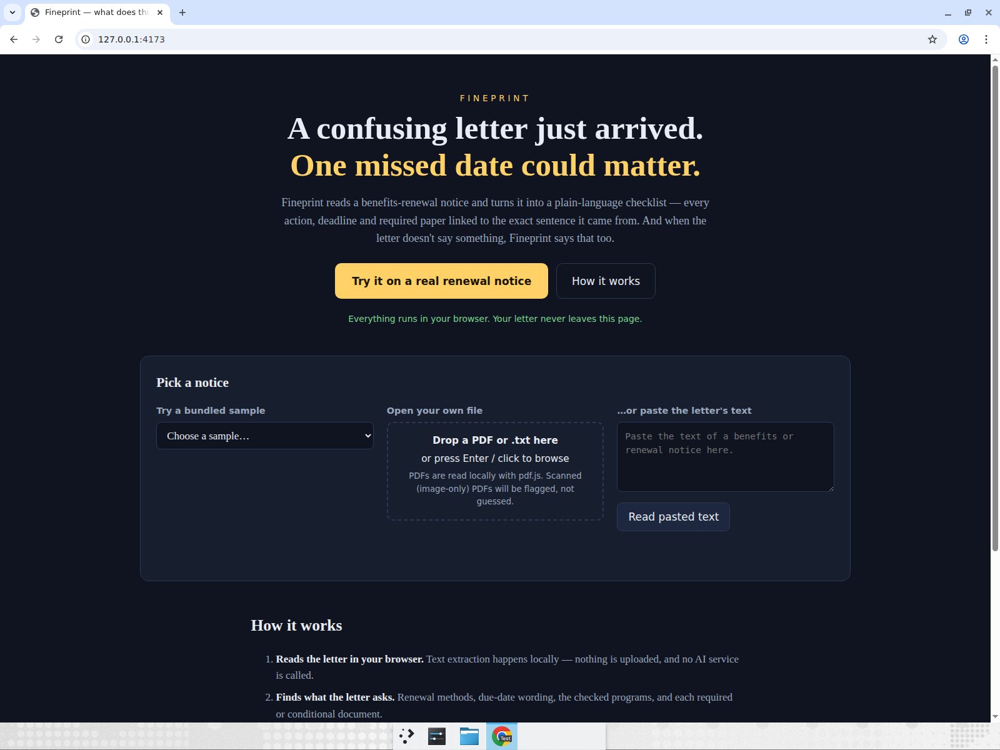
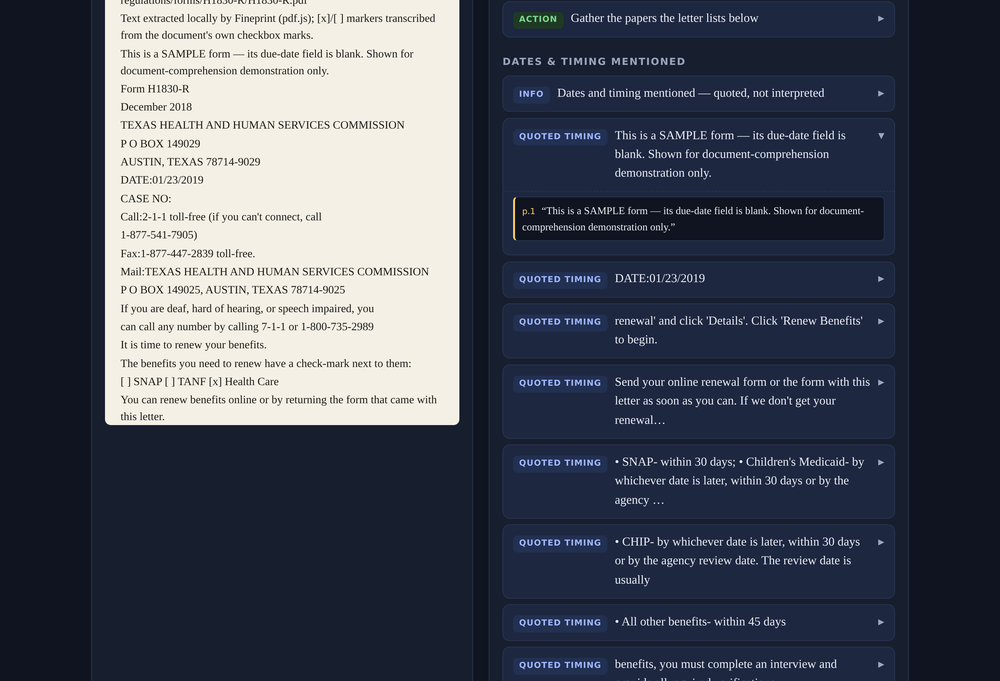
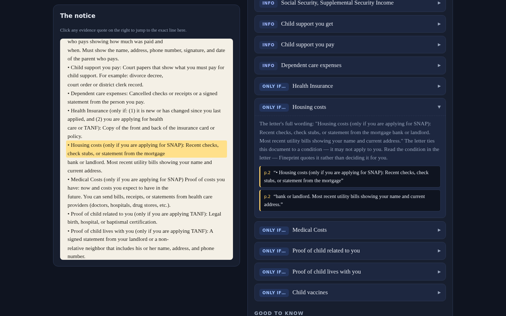
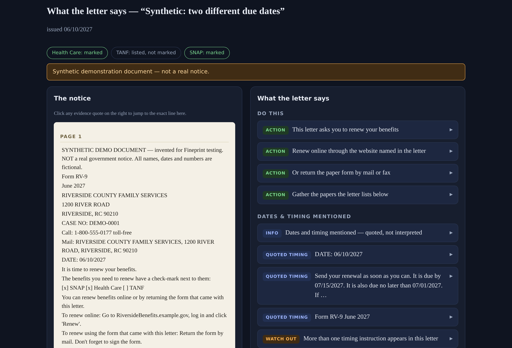
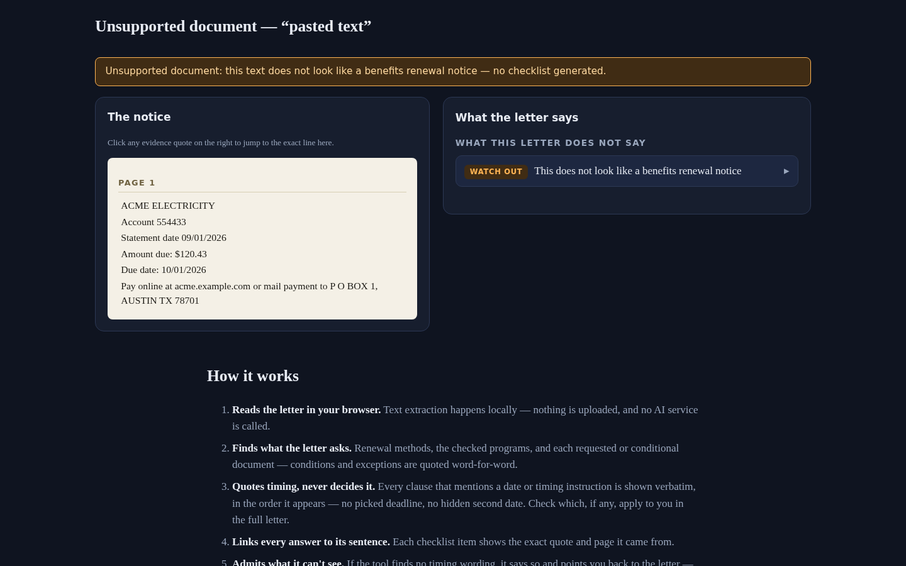

# Fineprint

**A confusing letter arrived. One missed date could matter. Fineprint shows you the letter's own words — organized, source-linked, never decided for you.**

Fineprint organizes selected passages from a benefits-renewal notice into an evidence index, with **clickable source quotes and page references**. Built for **WarriorHacks 2.0 (Hackathon track)**.

## Why

Benefit renewal letters bury the important parts — a due date, a checked box, a conditional document — in dense bureaucratic text. Miss it, and coverage can lapse for procedural reasons alone. Fineprint doesn't decide anything for you — it is an evidence organizer, not a verdict: it quotes the letter's own words and lets you check them.

## What it does

- **Scoped on purpose.** Fineprint is an *evidence reader* intended for benefits-renewal notices in the style of Texas form H1830-R — a stated intended-use limit, not a classifier. Text without renewal-notice vocabulary gets an honest "unsupported" view — not a confident checklist.
- **Dates are quoted, never decided.** The "Dates & timing mentioned" section is a quote-first index: selected timing excerpts — the sentences around dates and timing instructions — are shown verbatim, in source order, with jumps back to the letter. There is no "Respond by" card — no date is selected, assigned, or judged past/current. Excerpt coverage can be incomplete; always check the full letter. When several timing clauses appear, a generic reminder says to check for conflicting instructions; when none are found, it says "No timing excerpt found by this tool — check the full letter" rather than asserting no deadline exists.
- Reads a renewal notice **entirely in your browser** — text or PDF, nothing is uploaded, no AI service is called.
- Extracts: renewal methods (each step only when an exact supporting quote exists), which benefit programs are actually **check-marked**, requested vs. *conditional* documents (conditions quoted verbatim), contact info, and consequence wording.
- Extracted passages carry **clickable evidence quotes** that jump to their source lines. General guidance and missing-information notices are labeled separately.
- Scanned/image-only PDFs get an explicit "can't read this" warning — no OCR guessing, no silent failure.

## Demo

- **Video walkthrough (~2:14, narrated):** [docs/video/fineprint-walkthrough.mp4](docs/video/fineprint-walkthrough.mp4) — hero → the official Texas H1830-R blank 2018 sample → quote-first timing index → evidence click-through / source jumps → conditional documents → synthetic labeled samples → the honest unsupported view → the stated scope. Fresh full recording of the current UI.
- **Live demo:** https://sharonbasovich.github.io/fineprint-warriorhacks/ — deployed by GitHub Pages from `main`.

| | |
|---|---|
|  |  |
|  |  |
|  | |

## Run it

```bash
npm install
npm run dev        # dev server
npm run build      # typecheck + production build to dist/
npm test           # unit tests
npm run eval       # regression QA corpus → qa/report/QA-REPORT.md
npm run lint
```

## Project layout

```
src/core/pdf.ts       PDF → text + vector checkbox-mark detection (pdf.js operator list)
src/core/textdoc.ts   pasted/bundled text → same document model
src/core/dates.ts     date mention extraction used to locate timing excerpts
src/core/analyze.ts   deterministic parser → evidence-organizer items with verbatim quotes
src/ui/render.ts      side-by-side source document + checklist UI
public/samples/       bundled samples (see SOURCE-MANIFEST.md)
qa/corpus/            regression QA cases (expected findings + abstention assertions)
qa/run-eval.ts        eval harness: coverage, abstention violations, citation integrity
tests/                vitest unit tests
tools/                official-sample extraction script
```

## The honest part (limitations)

- **It's deterministic, not magic.** Rules are tuned to renewal-notice structure; a wildly different layout may produce fewer excerpts where a human would see more — check the full letter.
- **It reads, it does not decide.** No eligibility, medical, or legal determinations. No forms are submitted, no accounts touched, no government affiliation claimed.
- **Checkbox detection** reads vector marks in PDFs (and `[x]`/`[ ]`/`☒`/`☐` in text). If a PDF marks boxes in an unusual way, states degrade to "not readable" and are flagged as such rather than filled in.
- **No OCR.** Image-only scans are rejected loudly.
- Historical context: the bundled official sample is the blank December 2018 Texas HHSC form marked SAMPLE — shown for document comprehension, not current policy guidance. The date printed on it (e.g. 01/23/2019) is presented only as a date on the form; the tool makes no claim about what it legally means, and it is never treated as a deadline.
- **The QA corpus is author-built and no longer held out.** Metrics in `qa/report/QA-REPORT.md` are generated by running the project's own eval harness over cases written by the project team — and the cases were visible while the parser was being tuned (including cases derived from review findings). They are regression coverage — "the parser behaves as designed on these inputs" — not independent, held-out, or third-party evidence of accuracy on real notices.

## AI attribution

Fineprint was built for Sharon Basovich with AI-led assistance from dot and Devin (Cognition), including project planning, implementation, tests, review coordination, documentation, and demo preparation. Sharon authorized the project and its submission campaign. This description does not imply that Sharon personally implemented or reviewed the code. The walkthrough voiceover uses ElevenLabs text-to-speech. The application itself runs deterministic TypeScript — **no LLM is used or simulated at runtime**; summary labels are templated phrasing, always paired with the verbatim quote they came from.

## License

MIT (see LICENSE). Third-party libraries and the sample document are listed in [SOURCE-MANIFEST.md](SOURCE-MANIFEST.md).
