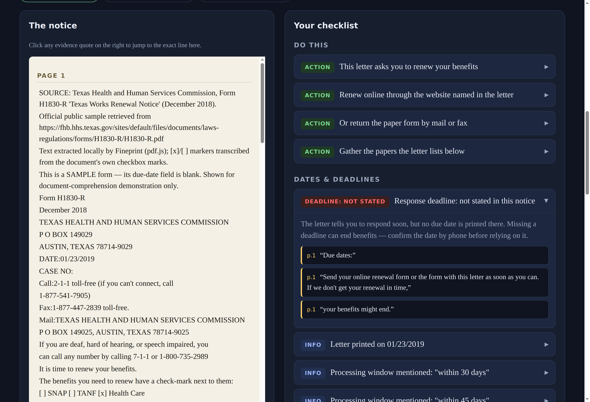

# Fineprint

**A confusing letter arrived. One missed date could matter. Fineprint shows you exactly what it asks — and admits what it doesn't say.**

Fineprint turns a benefits-renewal notice into a plain-language action checklist where **every answer is linked to the exact sentence and page it came from**. Built for **WarriorHacks 2.0 (Hackathon track)**.

## Why

Benefit renewal letters bury the important parts — a due date, a checked box, a conditional document — in dense bureaucratic text. Miss it, and coverage can lapse for procedural reasons alone. Fineprint doesn't decide anything for you. It makes the letter's asks visible and *honest*: if the notice doesn't print a deadline, Fineprint says "not stated" instead of inventing one.

## What it does

- Reads a renewal notice **entirely in your browser** — text or PDF, nothing is uploaded, no AI service is called.
- Extracts: renewal methods, **the response deadline** (or a visible "not stated" / "conflicting dates" card), which benefit programs are actually **check-marked**, required vs. *conditional* documents, contact info, and consequence wording.
- Every checklist item carries a **clickable evidence quote** that jumps to the exact line in the source pane.
- Distinguishes date types: notice date ≠ response deadline ≠ benefit end date ≠ appointment ≠ "within N days" processing windows.
- Scanned/image-only PDFs get an explicit "can't read this" warning — no OCR guessing, no silent failure.

## Demo

- **Video walkthrough (~2 min, narrated):** [docs/video/fineprint-walkthrough.mp4](docs/video/fineprint-walkthrough.mp4) — hero → the official Texas H1830-R blank 2018 sample (its due-date field is blank: Fineprint says *not stated*, quotes verbatim) → evidence click-through → conditional documents → synthetic conflicting-dates flag.
- **Live demo:** https://sharonbasovich.github.io/fineprint-warriorhacks/ — deployed by GitHub Pages from `main`.

| | |
|---|---|
|  |  |
|  |  |

## Run it

```bash
npm install
npm run dev        # dev server
npm run build      # typecheck + production build to dist/
npm test           # unit tests
npm run eval       # held-out QA corpus → qa/report/QA-REPORT.md
npm run lint
```

## Project layout

```
src/core/pdf.ts       PDF → text + vector checkbox-mark detection (pdf.js operator list)
src/core/textdoc.ts   pasted/bundled text → same document model
src/core/dates.ts     date extraction + per-date classification (local ±45 char context)
src/core/analyze.ts   deterministic parser → checklist items with verbatim evidence
src/ui/render.ts      side-by-side source document + checklist UI
public/samples/       bundled samples (see SOURCE-MANIFEST.md)
qa/corpus/            held-out QA cases (expected findings + abstention assertions)
qa/run-eval.ts        eval harness: coverage, abstention violations, citation integrity
tests/                vitest unit tests
tools/                official-sample extraction script
```

## The honest part (limitations)

- **It's deterministic, not magic.** Rules are tuned to renewal-notice structure; a wildly different layout may produce "not stated" where a human would see more.
- **It reads, it does not decide.** No eligibility, medical, or legal determinations. No forms are submitted, no accounts touched, no government affiliation claimed.
- **Checkbox detection** reads vector marks in PDFs (and `[x]`/`[ ]`/`☒`/`☐` in text). If a PDF marks boxes in an unusual way, states degrade to "not readable" — flagged, never guessed.
- **No OCR.** Image-only scans are rejected loudly.
- Historical context: the bundled official sample is the blank December 2018 Texas HHSC form marked SAMPLE — shown for document comprehension, not current policy guidance. Dates inside it (e.g. Jan 23, 2019) are the letter's *issue* dates, never deadlines.
- **The QA corpus is author-built.** Metrics in `qa/report/QA-REPORT.md` are generated by running the project's own eval harness over a corpus written by the same session that built the parser. They are regression coverage, not independent verification — treat "all cases pass" as "the parser behaves as designed on these inputs," not as outside audit results.

## AI attribution

Built by Sharon Basovich with AI assistance (Devin, by Cognition) for code generation, test authoring, and QA design. The walkthrough's voiceover was generated with ElevenLabs text-to-speech from a script written for this project. Parsing is deterministic TypeScript — **no LLM is used or simulated at runtime**; the "plain language" is templated phrasing always paired with the verbatim quote it came from.

## License

MIT (see LICENSE). Third-party libraries and the sample document are listed in [SOURCE-MANIFEST.md](SOURCE-MANIFEST.md).
